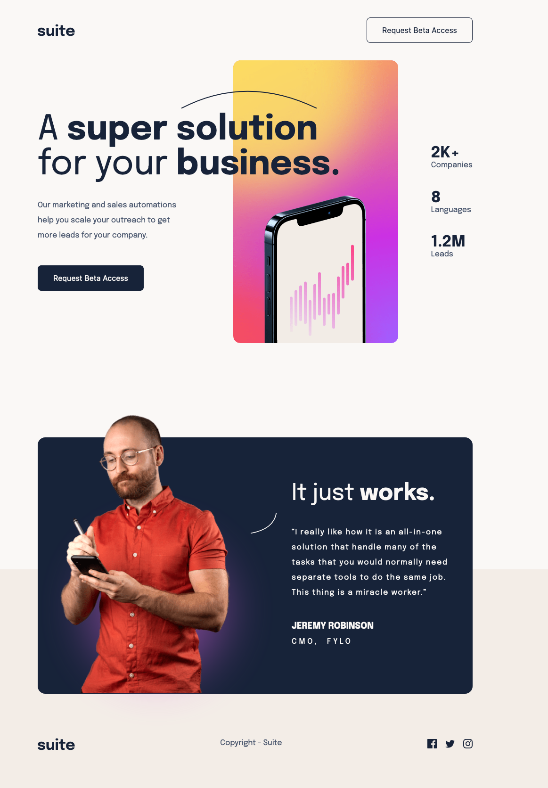

# Frontend Mentor - Suite landing page solution

This is a solution to the [Suite landing page challenge on Frontend Mentor](https://www.frontendmentor.io/challenges/suite-landing-page-tj_eaU-Ra). Frontend Mentor challenges help you improve your coding skills by building realistic projects.

## Table of contents

- [Overview](#overview)
  - [The challenge](#the-challenge)
  - [Screenshot](#screenshot)
  - [Links](#links)
- [My process](#my-process)
  - [Built with](#built-with)
  - [What I learned](#what-i-learned)
  - [Continued development](#continued-development)
- [Author](#author)
- [Acknowledgments](#acknowledgments)

## Overview

This project is a landing page created mostly to use responsive design concepts and techniques. Basic HTML and CSS technologies were used, Flexbox was used a lot for the positioning of elements and some transitions to update the buttons colors.

### The challenge

Users should be able to:

- View the optimal layout depending on their device's screen size
- See hover states for interactive elements

### Screenshot



### Links

- Solution URL: [Github repo](https://github.com/ernestoacosta1086/suite-landing-page)
- Live Site URL: [Live site](https://dynamic-fox-1d04c6.netlify.app/)

## My process

### Built with

- Semantic HTML5 markup
- CSS custom properties
- Flexbox
- Transitions

### What I learned

Examples on media queries and flexbox are shared to achieve the corresponding appearance on each screen. Some simple button animations were made to understand how CSS animations and transitions work. Some examples of the CSS code used can be found below:

```css
nav > button {
  padding: 1em 2em;
  border-radius: 0.5em;
  border: 0.1em solid var(--color-dark-blue);
  background: transparent;
  color: var(--color-dark-blue);
  font-size: 1em;
  transition: color 0.5s, background-color 0.5s;
}

nav > button:hover {
  color: var(--color-cream-white);
  background-color: var(--color-dark-blue);
  cursor: pointer;
}

@media only screen and (min-width: 481px) and (max-width: 768px) {
  body {
    padding: 0 1rem;
  }
  .hero-section {
    display: flex;
    flex-direction: column;
    justify-content: space-between;
    align-items: flex-start;
    width: 100%;
    height: 66rem;
    padding-top: 2rem;
  }
  .hero-description-div > h1 {
    font-size: 3rem;
  }
  .portrait-image {
    content: url("./assets/image-hero-landscape.png");
    width: 100%;
    max-height: 20rem;
    left: 0;
    position: relative;
    margin: 3rem 0;
  }
  .curved1-image {
    width: 12rem;
    left: 12.5rem;
    top: 0rem;
  }
```

### Continued development

I'll be focused on getting started with Grid within CSS and will start using Javascript in my future projects.

## Author

- Frontend Mentor - [@ernestoacosta1086](https://www.frontendmentor.io/profile/ernestoacosta1086)

## Acknowledgments

I highly recommend this Udemy course by Instructor Colt Steele, it is very well explained and covers most of the more complex concepts within CSS. Mainly the concepts of positioning with Flex, Grid and responsive layouts which I initially didn't understand very well until I reviewed the course.
https://www.udemy.com/course/html-and-css-bootcamp/
